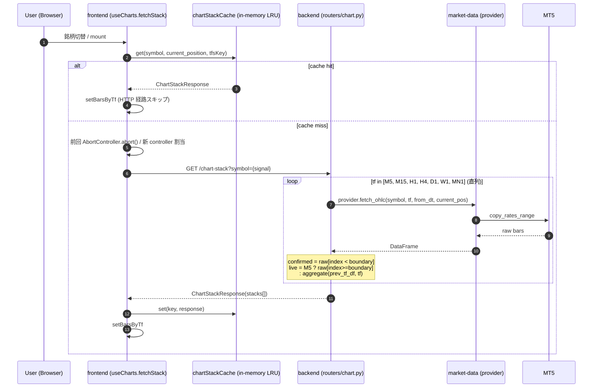
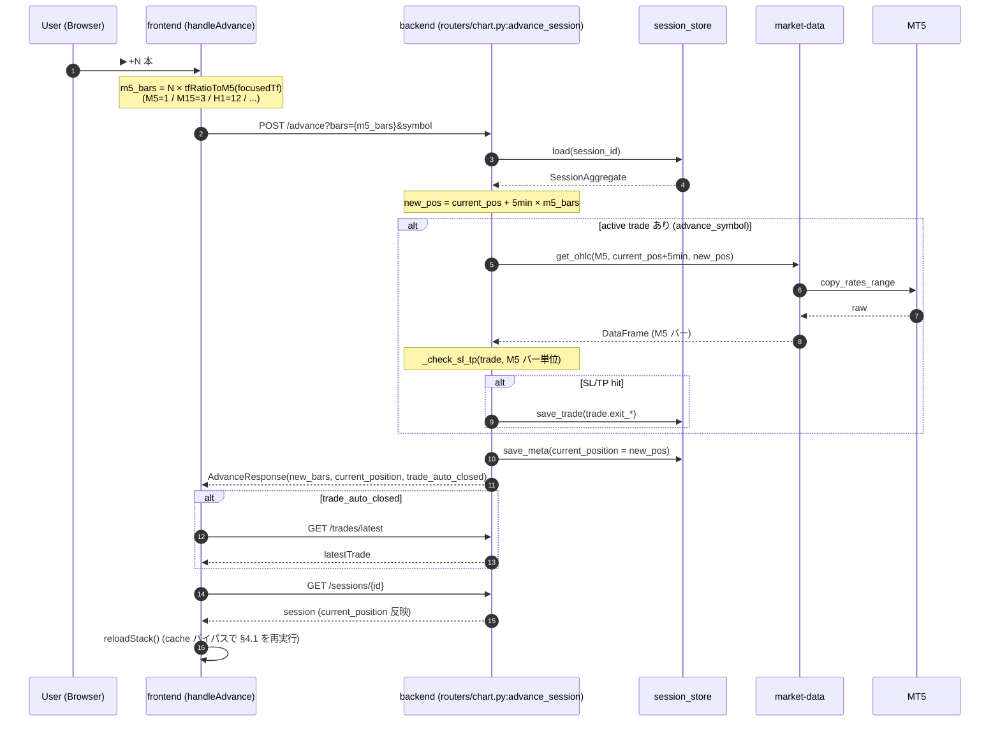
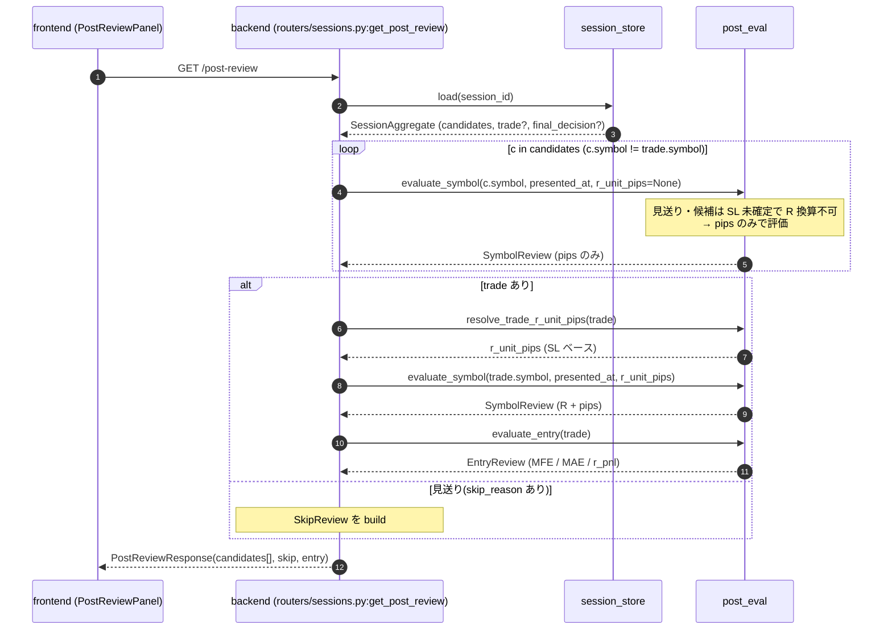
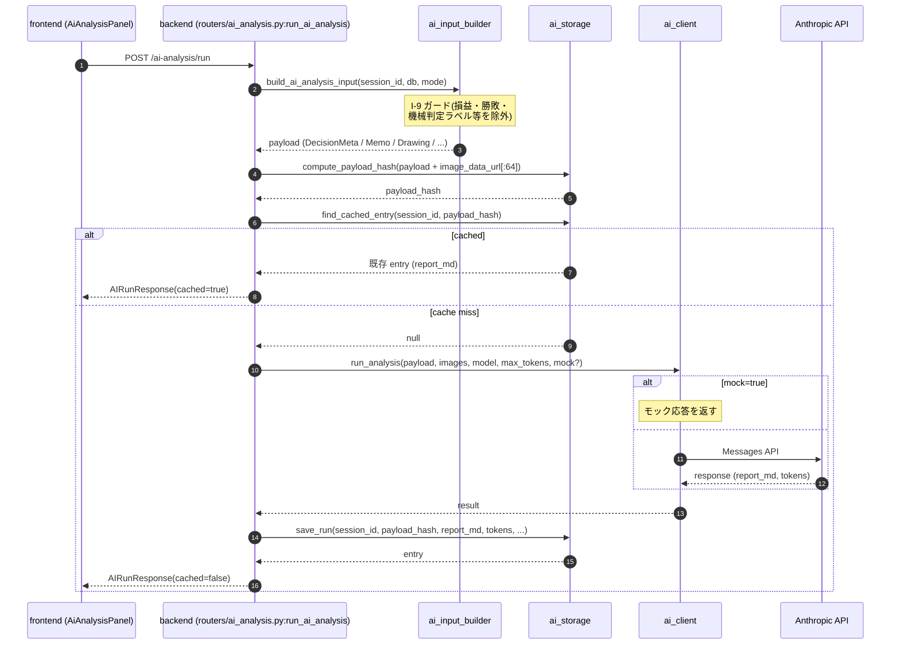

# 設計ドキュメント

← [仕様書](./spec/README.md) | [作業手順](./WORKFLOW.md)

---

ここには **コードがどう構成されているか・なぜそう作ってあるか** を記録する。仕様書(`docs/spec/`)が「何を実現したいか」を書くのに対し、本ドキュメントは「どう実現しているか」「守るべき不変条件」を書く。

[`WORKFLOW.md`](./WORKFLOW.md) のとおり、設計に影響する変更を行う前に該当セクションを更新し、変更後にも整合させる。

## 利用ルール

- 仕様変更タスク([WORKFLOW §A](./WORKFLOW.md))で **設計に影響がある場合**、関連セクションを先に更新してからコードを書く
- バグ修正タスク([WORKFLOW §B](./WORKFLOW.md))で **設計上の不変条件違反が原因だった場合**、修正前に該当セクションを更新する
- 本ファイル(トップレベル)は薄く保ち、層別の詳細設計は `architecture/*.md` に分割する。トップレベルが膨らんだら分割を検討する

## 設計ドキュメントが守るべきこと

- **責務 / 状態の所有 / インターフェース / 主要フロー / 不変条件** を含める
- コードを書き写さない(コードに変更があるとすぐ陳腐化する)。**契約と判断基準** を書く
- ファイル参照は `path:line` 形式(行番号は移動するのでセクション参照を併用)

---

## §1 ドキュメントマップ

設計は以下のファイルに分割されている。各ファイルは独立に読めることを目指している。

| ファイル | 範囲 | いつ読む |
|---|---|---|
| [`ARCHITECTURE.md`](./ARCHITECTURE.md)(本ファイル) | システム全体図 / frontend ↔ backend 役割境界 / 主要データフロー / 索引 | プロジェクトを初めて触るとき / 新機能設計時に「どこに置くか」を判定するとき |
| [`architecture/invariants.md`](./architecture/invariants.md) | 横断的な不変条件 I-1〜I-12(全層共通の前提) | 仕様変更・バグ修正の **着手前に必ず確認** |
| [`architecture/backend.md`](./architecture/backend.md) | backend(FastAPI / services / session_store)+ market-data(OHLC 取得 / プロバイダ抽象 / resample) | API 追加・変更 / セッションファイル仕様変更 / MT5 連携の修正時 |
| [`architecture/frontend-overview.md`](./architecture/frontend-overview.md) | frontend 全体構造(画面 / hooks / 状態の所有 / 主要フロー / API クライアント) | SessionPage / hooks / 一般的な UI 機能を触るとき |
| [`architecture/frontend-chart.md`](./architecture/frontend-chart.md) | Chart 関連(コンポーネント契約 / 座標系 / **TF 間 projection 規約** / LWC 境界カタログ / overlay 群 / アンチパターン記録) | チャート / overlay / 座標変換 / クロスヘア同期 を触るとき |
| [`architecture/drawing-tools.md`](./architecture/drawing-tools.md) | 描画モード状態機械(`useDrawingInteraction` / `dispatchEvent` / tool metadata) | 描画ツールの修正・追加時 |

設計に大きな変更が入る場合の更新フロー:

1. このトップレベルの「§3 役割境界」「§4 主要データフロー」が動くか確認(動くならまずここから更新)
2. 該当する詳細ファイル(`backend.md` / `frontend-*.md` / `drawing-tools.md`)を更新
3. 横断不変条件に新規追加が必要なら `invariants.md` に追加し、各詳細ファイルからリンク

---

## §2 システム全体図

### 2.1 リポジトリ構成

```
trade-training/
├─ apps/
│  └─ trade-trainer/          ← 訓練アプリ(本番第一弾)
│     ├─ backend/             ← FastAPI(Python) — backend.md
│     └─ frontend/            ← React + Vite + lightweight-charts — frontend-overview.md / frontend-chart.md
├─ packages/                  ← 複数アプリで共有するライブラリ
│  ├─ market-data/            ← OHLC 取得 / Provider 抽象 — backend.md §C
│  └─ shared-schema/          ← SQLAlchemy モデル + Alembic マイグレーション
├─ data/
│  ├─ sessions/               ← ユーザー入力(セッション情報)— backend.md §B
│  ├─ memo-templates/         ← メモ初期テンプレ
│  └─ trading.db (SQLite)     ← 機械生成キャッシュ + Settings
└─ docs/
   ├─ ARCHITECTURE.md         ← 本ファイル(トップレベル)
   ├─ architecture/           ← 層別詳細
   │  ├─ invariants.md
   │  ├─ backend.md
   │  ├─ frontend-overview.md
   │  ├─ frontend-chart.md
   │  └─ drawing-tools.md
   ├─ spec/                   ← 仕様書(何を作るか)
   └─ WORKFLOW.md             ← 作業手順(必読)
```

### 2.2 アプリ起動シーケンス(backend)

```
uvicorn → main.create_app() → FastAPI(lifespan=lifespan)

lifespan:
  1. init_db(db_path)               # SQLAlchemy エンジン初期化
  2. run_all_seeds(session)         # Settings 等のシード
  3. load_memo_templates()          # data/memo-templates → in-memory
  4. configure(db_path, MT5Provider if use_mt5 else None)
       └ MT5Provider().initialize()  # mt5.initialize()
  5. yield  ← 受付開始
  6. shutdown / mt5.shutdown
```

### 2.3 画面遷移(frontend)

```
LoginPage
   │ password 入力
   ▼
SessionListPage
   │ 既存セッション一覧 / 新規作成
   ▼
SessionPage(統合フロー、§6.1)
   │  phase = 'analyzing' | 'holding' | 'reviewing' を session 状態から導出
   │  すべて 1 画面内で処理(画面遷移なし)
```

詳細は [`frontend-overview.md` §C SessionPage のフェーズ導出](./architecture/frontend-overview.md#c-sessionpage-のフェーズ導出)。

---

## §3 frontend / backend 役割境界

このプロジェクトは **「frontend は表示と UI 状態に閉じる、backend は永続化と真実を持つ」** を厳守する。新機能設計時はまずこの境界に沿って配置を決める。

### 3.1 4 軸で役割を定義する

| 軸 | frontend の責務 | backend の責務 | 境界の不変条件 |
|---|---|---|---|
| **1. データの真実 (Source of Truth)** | UI 状態のみ(visible range / focus TF / modal 開閉 / entry draft / hover state / star マーク表示状態) | セッション情報・Trade・描画・メモ・`current_position`・設定・AI レポートの**永続化された真実** | frontend は backend 由来のデータを **読み取り専用キャッシュ** として扱う。編集は必ず HTTP 経由で backend に通し、レスポンスで自分のキャッシュを更新する |
| **2. 計算の場所** | UI 計算(座標変換・インジケーター描画・tooltip・色決定・hover 判定) | ドメイン計算(MT5 集約・SL/TP 自動判定・見送り評価・AI 入力構築・経済指標フィルタ) | 同じ計算を 2 箇所で行わない。境界をまたぐ計算は片方を真実として他方は受け取るだけ |
| **3. 時刻 / タイムゾーン** | UTC を保ったまま受け取り、表示時のみ `formatJST` 経由で JST 変換 | 全処理・全永続化を UTC で統一(ISO 8601 + `Z` で API 境界を明示) | naive datetime は層境界で必ず UTC aware に補完([invariants.md I-1](./architecture/invariants.md#i-1-タイムスタンプは-utc-で統一する)) |
| **4. ライフサイクル** | セッション内のみ(タブクローズで消失)。編集中 draft は blur / unmount で消失 | プロセス再起動越え(ファイル / SQLite で永続) | frontend で永続化したいものは backend 経由で送る。frontend がモジュールスコープに持つ state は「セッション内だけ生存していい」ものに限る |

### 3.2 役割判定チェックリスト(新機能設計時)

新機能を設計するとき、以下を順に問う:

1. **真実は誰が持つか?**
   - 永続化が必要 / 他セッションから見える / API レスポンスから来る → **backend**
   - ブラウザリロードで消えてよい / 単一タブ内のみ → **frontend**
2. **計算の場所は?**
   - MT5 / DB / セッションファイルにアクセスする → backend
   - DOM / Chart の座標系 / マウス位置に絡む → frontend
   - その他はデータの近くに置く(真実が backend なら backend、frontend キャッシュなら frontend)
3. **HTTP 境界をまたぐか?**
   - またがない: 片方の設計ファイルだけで完結 (`frontend-*.md` or `backend.md`)
   - またぐ: 本ファイルの「§4 主要データフロー」にエンドポイントを追加し、両ファイルを更新

このチェックリストは [`WORKFLOW.md §A-2.1`](./WORKFLOW.md) の設計レビューで参照する。

### 3.3 過去事例で見る役割境界

抽象だけでなく、現在の機能 5 件で「どの軸でどう判定したか」を記録する。新機能設計時に「これに似たやつはどこにある?」のリファレンスとして使う。

| 機能 | データの真実 | 計算の場所 | 永続化 | 配置 |
|---|---|---|---|---|
| **chart-stack 取得** | MT5(broker)→ backend が中継 | backend(集約 / 直列フェッチ)、frontend は表示 + LRU cache | frontend は in-memory cache のみ | [`backend.md` §D.1](./architecture/backend.md#d1-get-sessionsidchart-stack-routerschartpychart_stack), [`frontend-overview.md` §E useCharts](./architecture/frontend-overview.md#e-usecharts-の契約) |
| **描画 (Drawing)** | backend (`session.json` 内 `drawings`) | frontend(座標変換 + 編集 UI)、backend は CRUD | backend 永続 | [`drawing-tools.md`](./architecture/drawing-tools.md), [`frontend-chart.md` §5.2](./architecture/frontend-chart.md#52-drawingoverlay) |
| **visible range** | frontend(Chart instance 内) | frontend(LWC 内部) | しない(タブクローズで消失) | [`frontend-chart.md` §4](./architecture/frontend-chart.md#4-chart-instance-の-lifecycle-と-useeffect-責務) |
| **エントリー draft (SL/TP 配置中)** | frontend(`useTradeFlow.entryDraft`) | frontend(クリック → 価格丸め) | しない、確定時に backend へ POST | [`frontend-overview.md` §F.3](./architecture/frontend-overview.md#f3-sltp-配置) |
| **AI レポート** | backend (`ai_analysis/{entry_id}.md`) + payload hash cache | backend(Anthropic API 呼び出し)、frontend は表示のみ | backend 永続(セッションごと) | [`backend.md` §D.6](./architecture/backend.md#d6-post-sessionsidai-analysisrun-routersai_analysispyrun_ai_analysis) |

### 3.4 責務原則の言語化

- **frontend は market-data を直接呼ばない**(必ず backend 経由)
- **backend service は HTTP の知識を持たない**(将来 CLI 化の見通し)
- **market-data は backend service の概念(セッション等)を知らない**(`get_ohlc(symbol, tf, from_dt, to_dt)` レベルの純粋取得に徹する)
- **同じ概念を 2 箇所で持たない**(状態の二重所有はバグの温床、[`WORKFLOW.md §B-2`](./WORKFLOW.md))

---

## §4 主要データフロー(俯瞰)

詳細は各層の設計ファイル参照。ここでは **HTTP 境界をまたぐ主要 4 フロー** をシーケンス図で俯瞰する。図は「router が service を呼ぶ」レベルの抽象度に揃え、実装の細部(変数名・loop 内の if 分岐等)は意図的に省く。

各図の表記:
- 実線矢印(`->>`): 同期呼び出し / リクエスト
- 破線矢印(`-->>`): リターン / レスポンス
- `alt` / `else`: 条件分岐
- `loop`: 繰り返し
- `Note`: 補足

### 4.1 チャート表示(GET `/sessions/{id}/chart-stack`)



詳細: [`backend.md` §C.2](./architecture/backend.md#c2-取得フロー) / [`frontend-overview.md` §E](./architecture/frontend-overview.md#e-usecharts-の契約)

### 4.2 足進め(POST `/sessions/{id}/advance`)



「+1 本」= focus TF の 1 バー(仕様 §5.1.1)。詳細: [`backend.md` §D.2](./architecture/backend.md#d2-post-sessionsidadvance-routerschartpyadvance_session) / [`frontend-overview.md` §F.2](./architecture/frontend-overview.md#f2-handleadvance)

### 4.3 振り返り(GET `/sessions/{id}/post-review`)



詳細: [`backend.md` §D.5](./architecture/backend.md#d5-get-sessionsidpost-review-routerssessionspyget_post_review)

### 4.4 AI 分析(POST `/sessions/{id}/ai-analysis/run`)



詳細: [`backend.md` §D.6](./architecture/backend.md#d6-post-sessionsidai-analysisrun-routersai_analysispyrun_ai_analysis)

---

## §5 データの所有(永続化レイヤ別)

| データ | ストア | 同期対象 | 詳細 |
|---|---|---|---|
| セッション情報(セッション・候補・Trade・見送り・描画・保有メモ) | `data/sessions/{dir}/` ファイル群 | ✓(Dropbox 等) | [`backend.md` §B](./architecture/backend.md#b-セッションファイル構造) |
| メモテンプレート | `data/memo-templates/*.md` | git | リポジトリ内、起動時 1 回ロード |
| OHLC キャッシュ(TF 別、現状未使用) | SQLite `ohlc` | ✗(再取得可能) | [`backend.md` §C](./architecture/backend.md#c-market-data-層) |
| 経済指標 | SQLite `economic_events` | ✗(再取得可能) | market-data CLI が日次で取得 |
| アプリ設定 | SQLite `settings` | ✗ | 単一行 |
| AI 分析結果 | `data/sessions/{dir}/ai_analysis/` | ✓(同期推奨) | セッションと同経路 |

「セッション情報を SQLite に書く」「OHLC をファイルに書く」を **やらない**([invariants.md I-3](./architecture/invariants.md#i-3-ファイル管理-vs-sqlite))。

---

## §6 横断不変条件への入口

詳細は [`architecture/invariants.md`](./architecture/invariants.md)。1 行要約のみ:

| ID | テーマ | 1 行要約 |
|---|---|---|
| [I-1](./architecture/invariants.md#i-1-タイムスタンプは-utc-で統一する) | UTC 規律 | アプリ全体で datetime は UTC、JST 表示は frontend のみ |
| [I-2](./architecture/invariants.md#i-2-チャート取得は単一-chart-stack-エンドポイントで直列フェッチ--最新バーは下位-tf-集約) | チャート取得 | 単一 chart-stack で直列フェッチ、最新バーは下位 TF 集約 |
| [I-3](./architecture/invariants.md#i-3-ファイル管理-vs-sqlite) | 保存先分離 | ユーザー入力 = ファイル / 機械生成 = SQLite |
| [I-4](./architecture/invariants.md#i-4-ファイル書き込みは単純書き込み) | 書き込み単純化 | atomic 書き込みは採用しない |
| [I-5](./architecture/invariants.md#i-5-セッションの進行中決着済み状態モデル) | セッション状態 | `settled_at` の有無で進行中 / 決着済みを導出 |
| [I-6](./architecture/invariants.md#i-6-current_position-の単一情報源) | 現在位置 | `session.json` の `current_position` が真実 |
| [I-7](./architecture/invariants.md#i-7-バー時系列の単調性) | バー昇順 | 全層で時刻昇順・重複なし |
| [I-8](./architecture/invariants.md#i-8-上位-tf-のライブバー扱い) | ライブバー | 進行中バーは未確定として扱う |
| [I-9](./architecture/invariants.md#i-9-ai-分析の送信ガードレール) | AI ガード | 結果論バイアスを与えない |
| [I-10](./architecture/invariants.md#i-10-observability-の最低ライン) | observability | silent failure を作らない |
| [I-11](./architecture/invariants.md#i-11-エラー処理--失敗の可視化) | エラー処理 | 6 項目: silent 禁止 / 捕捉スコープ / 空 vs 失敗 / UI 通知 / trust boundary / デフォルト返却 |
| [I-12](./architecture/invariants.md#i-12-座標変換と-tf-間-projection) | 座標変換 | 単一 Chart 内は LWC 信頼、TF 間 projection は純粋関数経由 |

---

## §7 既知の落とし穴(全層横断)

各層の落とし穴は層別ファイルに記載。ここでは「層をまたぐ」または「設計判断ミスから生まれる」典型例だけ抜粋する。

| 事象 | 原因と対処 |
|---|---|
| 「チャート / overlay の座標がズレる」 | 単一 Chart 内なら LWC API を信頼 / TF 間 projection なら純粋関数経由(I-12)。詳細 [`frontend-chart.md` §2](./architecture/frontend-chart.md#2-座標系と-tf-間-projection-の規約) |
| 「銘柄切替を連続で行うと途中から極端に遅い」 | frontend が AbortController で進行中 fetch を中断していない。`useCharts.abortControllerRef` 不在(現在は実装済)。詳細 [`frontend-overview.md` §H.2](./architecture/frontend-overview.md#h2-usechartsabortcontrollerref-の-abortcontroller-管理51-7) |
| 「同じ概念を frontend / backend 双方で計算してずれる」 | 役割境界違反。§3 で配置を判定し直す。例: SL/TP 自動判定は backend のみで実施(frontend からは結果を受け取るだけ) |
| 「naive datetime が JST として解釈され価格がズレる」 | I-1 違反。MT5 / DB / API 境界で必ず UTC aware に補完 |
| 「空チャート + 通知無し」 | I-11.4 違反。ユーザー入力起因の失敗は必ず notify |

層別の細かい落とし穴は各設計ファイルの「既知の落とし穴」節を参照:

- [`backend.md` §F](./architecture/backend.md#f-既知の落とし穴)
- [`frontend-overview.md` §H](./architecture/frontend-overview.md#h-既知の複雑さと落とし穴)
- [`frontend-chart.md` §7](./architecture/frontend-chart.md#7-アンチパターン記録過去の失敗から)
